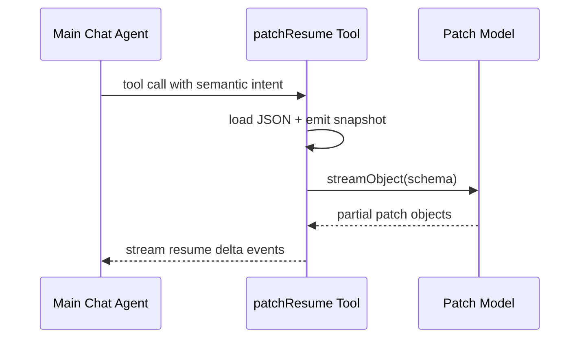

# Session ses_379737fffffe4Iduj8AwJoKco9 (Part 6/8)

## user (2026-02-23T16:18:15.748Z)

Continue with impelmenting updates to the resume-chatbot.mdx article. Here is context ```# Write restructured content to file
$ cat > /Users/nroth/workspace/nickroth/src/content/work/resume-chatbot.mdx << 'CONTENT_EOF'
---
title: "AI-Powered Resume Builder with Real-Time Streaming"
description: "Building an intelligent resume editor using Next.js, Vercel AI SDK, and surgical JSON patching for real-time collaborative editing."
company: "Personal Project"
role: "Full-Stack Developer"
startDate: 2024-11-01
featured: true
tags: ["AI", "Next.js", "Streaming", "Real-time"]
image: "../../assets/images/projects/resume-chatbot.png"
category: "AI APPLICATION"
impact: "REAL-TIME COLLABORATIVE EDITING WITH AI-POWERD RESUME OPTIMIZATION."
stack: ["NEXT.JS", "VERCEL AI SDK", "DRIZZLE ORM", "+4"]
roleCategory: "FULL-STACK DEVELOPER"
---
import LazyVideo from '../../components/LazyVideo.astro';
import FeatureBlock from '../../components/FeatureBlock.astro';
import ExcalidrawDiagram from '../../components/diagram/ExcalidrawDiagram.astro';
import Callout from '../../components/Callout.astro';
# AI-Powered Resume Builder with Real-Time Streaming
## <span class="h2-prefix">THE CHALLENGE:</span> <span class="h2-title">When AI document editing goes off the rails</span>
**You're in a conversation with your resume.**
You type: *"Add Python to my skills and tighten up that Backend Engineer summary to highlight the API work."* You expect surgical precision—a new skill entry here, a rewritten paragraph there, everything else untouched.
But that's not how AI-driven document editing usually works.
Without structure, the same request might rewrite your entire skills section, drop half your job history, or generate a summary that sounds nothing like you. Worse, agents often read only portions of the document and make assumptions about the rest. As patches accumulate on top of incorrect assumptions, errors compound. The problem isn't the AI's intent—it's the lack of **constraints**.
**Real-time collaboration requires three things:**
<FeatureBlock
  title=""
  features={[
    {
      title: "A Schema",
      description: "Every resume field follows a predictable structure—skills, experience, projects—so the UI renders consistently no matter who edits what"
    },
    {
      title: "Live Feedback",
      description: "Changes appear as they happen. No waiting, no wondering if your edit landed, no surprises when the response finally arrives"
    },
    {
      title: "Surgical Updates",
      description: "Modifications target exactly what you specify without touching adjacent content—whether the AI makes them or you do"
    }
  ]}
/>
**Core challenges with AI-driven document edits:**
- **Partial context windows**—Edits apply to a slice and drop linked context, even when the user expects global context to be preserved
- **Ambiguous match targets**—Similar text blocks cause the wrong node to be rewritten instead of the exact entry selected by the user
- **Patch sequencing drift**—Multiple edits that should apply cleanly instead cause newline boundaries to shift and list formatting to degrade
- **Unstable insertion behavior**—Partial output causes jumps, placeholders, and visual jitter instead of smooth text appearance
- **Rich-format constraints**—Markdown-first edits break typed structures downstream, even when fields should stay validated and schema-safe
These failure modes compound when multiple users, models, or edits operate concurrently. Small unpredictabilities become merge conflicts, audit blind spots, and a poor UX that erodes trust.
<ExcalidrawDiagram
  src="/docs/project/resume-chatbot-simple.svg"
  alt="Resume chatbot concept diagram showing user request flowing through AI processing to structured resume output"
  height="500px"
/>
## <span class="h2-prefix">STRUCTURED DATA:</span> <span class="h2-title">The foundation for reliable editing</span>
The solution to unpredictable AI edits is structure. When every piece of content has a defined location and format, changes become precise and isolated.
**Why structure prevents errors:**
- **Isolation**—Each field lives at a specific path (`/skills/0/name`), so edits can't accidentally bleed into adjacent content
- **Validation**—Schema enforcement catches malformed data before it reaches the document
- **Predictability**—The UI knows exactly how to render each field type, regardless of who made the change
[JSON Resume](https://jsonresume.org/) serves as the data format—an open-source standard for representing resume data as structured JSON. This format provides a simple yet extensible schema that covers all essential resume sections: basics, work experience, education, skills, projects, and more.
**Why JSON Resume:**
- **Established standard**—Widely adopted schema with clear documentation and community support
- **Built-in validation**—JSON Schema definition enables automated validation of resume structure and data types
- **Existing tooling**—Ecosystem includes renderers for HTML export and PDF generation
- **Extensible design**—Custom properties can be added for domain-specific needs while maintaining compatibility
- **Portable format**—Plain JSON enables easy data migration and interoperability
In practice, the JSON Resume schema is used for data storage and validation (via Zod), but a custom renderer was built to match the application's visual style rather than using off-the-shelf HTML themes. This provides complete control over the presentation while benefiting from the standard's structured data model.
Structured paths are unambiguous: a pointer like `/skills/0/name` refers to the first skill's name. Contrastingly, asking "find JavaScript in the text" can hit many places, match partial phrases, or pick the wrong list. With JSON Pointers and RFC 6902 patches we target exact keys and array indices.
Finally, mutations are validated with a schema layer (Zod in this stack). Zod catches missing required fields, wrong types, and invalid shapes before a patch is applied, so the editor never writes malformed resume state.
**But structure introduces a new challenge.** Traditional structured editing feels batch-based and slow. You make a request, wait for the AI to process, and then see the complete result. This breaks the conversational flow users expect from chat interfaces. The question becomes: *Can we have both the reliability of structured data and the responsiveness of streaming text?*
## <span class="h2-prefix">THE STREAMING PARADOX:</span> <span class="h2-title">Structure vs. real-time feedback</span>
When building AI-powered interfaces, not all streaming is the same. Each stream type has different reliability characteristics and UX implications—and this creates a fundamental tension.
### Text Streams
Human-facing response text for conversational flow. Great for chat, but problematic for structured edits at scale. A large sequence of edits often results in accidentally overwriting information or duplicating headings—especially as the context grows for the primary agent.
Text streams also limit the ability to provide rich, custom rendering. A spreadsheet rendered as Markdown is difficult to edit precisely. An agent can't practically make small edits to a Markdown table cell without regenerating the entire table.
Yet text streaming has one clear advantage: **you can follow along as the agent works**. You see the edits happening in real-time, like watching a human collaborator type.
<Callout type="tip" label="Core Challenge">
  How to combine **rich custom rendering** with **streaming edits**? The goal is to watch the agent work in real-time, like a human collaborator typing, but structured components—tables, code blocks, resumes—are also needed that plain text can't provide.
</Callout>
### Object/Tool-Call Streams
Machine-facing structured outputs for deterministic actions. Frameworks like the Vercel AI SDK support `streamObject`, which can stream structured tool calls incrementally.
```json
{
  "tool": "addSkill",
  "arguments": { "name": "Python", "level": "intermediate" }
}
```
The challenge: tools like `addSkill` are **schema-specific**. Each field pattern needs its own tool definition, so the approach doesn't transfer to other document types. A spreadsheet editor would need entirely different tools (`addColumn`, `updateCell`), and a code editor would need yet another set. This fragments prompting strategies and prevents reuse across domains.
Even with streaming, the user still waits for each complete tool call before seeing updates—and the complexity of managing dozens of field-specific tools grows quickly.
### The Fundamental Tension
We need structure for reliability, but we want streaming for UX. Traditional approaches force a choice:
- **Text streaming** = great UX, no structure
- **Full object streaming** = great structure, poor UX (wait for everything)
The gap: Can we stream structured updates? To answer that, we need to understand how LLM streaming actually works under the hood.
## <span class="h2-prefix">HOW STREAMING WORKS:</span> <span class="h2-title">From tokens to structured objects</span>
LLMs don't emit complete objects—they emit raw text tokens one at a time. Modern AI SDKs accumulate these tokens and parse them into valid JSON incrementally. Understanding this mechanics is key to bridging the structure-vs-streaming gap.
### Partial-Object Streams
The Vercel AI SDK's `streamObject` can return objects in two modes:
**Complete objects**: Wait for the entire object to validate against your schema before emitting. The user sees nothing until the full object is ready.
**Partial objects** (the approach used here): Receive `DeepPartial<YourSchema>` as tokens arrive. Each emission is valid JSON but may not satisfy your schema yet. You decide when it's "complete enough" to use.
```ts
// Using partial object stream—updates arrive as they are generated
const result = streamObject({ model, schema: patchSchema, prompt });
for await (const partial of result.partialObjectStream) {
  // partial is DeepPartial<PatchOperation>—valid JSON, but may not match schema yet
  // The task: decide when it's safe to apply
  if (isCompleteEnough(partial)) {
    applyPatch(document, partial);
  }
}
```
**How it works step by step:**
The LLM emits raw text tokens. The AI SDK accumulates them and parses into valid JSON at each step:
```javascript
// LLM begins emitting: '{ "op": "repl'
// AI SDK accumulates and parses as valid JSON:
{ "op": "repl" }
// More tokens arrive: 'ace", "path": "/summary"'
// AI SDK now parses complete op + path:
{ "op": "replace", "path": "/summary" }
// Value starts streaming: ', "value": "S'
{ "op": "replace", "path": "/summary", "value": "S" }
// Continues building: 'enior bac'
{ "op": "replace", "path": "/summary", "value": "Senior bac" }
// Complete value: 'kend engineer with 8+ years'
{ "op": "replace", "path": "/summary", "value": "Senior backend engineer with 8+ years experience" }
```
**Key insight**: The AI SDK guarantees valid JSON at each step, but it doesn't guarantee the object matches your schema. That's the implementation's responsibility. In the example above, having complete `op` and `path` might be "complete enough" to start showing the edit in progress, even before the full `value` arrives.
**Streaming object values** works the same way—nested properties fill in as tokens arrive:
```javascript
// Object value starts building
{ "op": "add", "path": "/skills/-", "value": { "nam": undefined } }
// Key completes, next property starts  
{ "op": "add", "path": "/skills/-", "value": { "name": "Pytho", "level": undefined } }
// Values stream in character by character
{ "op": "add", "path": "/skills/-", "value": { "name": "Python", "level": "intermedia" } }
// Complete object
{ "op": "add", "path": "/skills/-", "value": { "name": "Python", "level": "intermediate" } }
```
**Why this matters**: Without partial objects, you'd wait for the entire operation to complete before showing anything. With partial objects, you can start rendering progress immediately—but you need a stabilization layer to decide what's safe to display vs what's still incomplete.
This becomes even more important when batching multiple patches in one tool call (an array of operations). With partial object streaming, the AI SDK provides a valid array structure as objects accumulate—you can process each patch as it arrives. With whole object streaming, you'd wait even longer for ALL patches to complete before seeing any progress.
**Related documentation:**
- [LangChain.js documentation](https://js.langchain.com/)
- [Mastra agents and streaming](https://mastra.ai/en/docs/agents/overview)
- [Vercel AI SDK streamObject](https://ai-sdk.dev/docs/reference/ai-sdk-core/stream-object)
- [BAML streaming and partial parsing](https://docs.boundaryml.com/)
Now that we understand how partial streaming works mechanically, let's evaluate the different approaches for building reliable document editing on top of it.
## <span class="h2-prefix">EVALUATING OPTIONS:</span> <span class="h2-title">Three approaches to structured edits</span>
Given the problem and the streaming options available, three approaches were evaluated for implementing AI-driven document edits.
### Option A: Schema-Specific Tool Surface
Create many discrete tools like `addWorkItem`, `replaceSummary`, `updateSkill`, each with custom inputs tailored to the resume schema.
**Pros:**
- Easy to reason about for one narrow schema
- Type-safe by design
**Cons:**
- Tool count grows with every new field pattern
- Streaming contracts fragment across tools
- Cross-document reuse collapses—each new document type needs its own complete tool suite
### Option B: Full-Object Structured Generation
Stream or generate one complete typed object and replace the entire document state after validation.
**Pros:**
- Clean contract for final state
- Strong schema guardrails
**Cons:**
- Poor incremental UX for large artifacts
- Small edits (like adding one skill) wait for the entire object to generate and validate
  - [AI SDK generateObject](https://ai-sdk.dev/docs/reference/ai-sdk-core/generate-object)
  - [Mastra structured output](https://mastra.ai/docs/agents/structured-output)
  - [LangChain.js documentation](https://js.langchain.com/)
### Option C: Streaming JSON Patch (Chosen)
Emit [RFC 6902](https://datatracker.ietf.org/doc/html/rfc6902) operations (`add`, `replace`, `remove`, `move`, `copy`, `test`) against stable JSON pointers. Treat the resume as typed JSON, not a text blob. Every mutation is one explicit operation against one explicit path.
**Pros:**
- Low-latency, path-scoped updates with deterministic apply semantics
- One mutation model works across nested objects, arrays, and other structured documents
- Enables true incremental rendering—users see changes as they arrive
**Core principles:**
- **Immutable structure:** the document schema stays stable while values change.
- **Atomic operations:** apply `add`, `replace`, `remove`, `move`, `copy`, and `test` from RFC 6902.
- **Deterministic result:** no broad regeneration, no accidental section rewrites.
```json
{
  "op": "replace",
  "path": "/skills/2/name",
  "value": "React"
}
```
**Why JSON Patch wins:**
Unlike schema-specific tools, RFC 6902 operations are universal. The same `add`, `replace`, and `remove` verbs work for resumes, spreadsheets, code files, or any JSON document. This means:
- **Reusable prompting**—The same instructions work across document types
- **Simpler mental model**—Six operations cover all mutations
- **Standard tooling**—Existing libraries for validation, testing, and diffing
- **Auditable history**—Every change is an explicit, reversible operation
## <span class="h2-prefix">THE SOLUTION:</span> <span class="h2-title">Streaming JSON Patch with partial-object stabilization</span>
This implementation uses Option C—streaming JSON Patch with partial-object streams—because it uniquely combines the responsiveness of streaming with the precision of structured operations.
### The Data Model: JSON Resume as Stable Surface
[JSON Resume](https://jsonresume.org/) serves as the data format—an open-source standard for representing resume data as structured JSON. This format provides a simple yet extensible schema that covers all essential resume sections: basics, work experience, education, skills, projects, and more.
```json title="resume.json" collapse={10-118}
{
  "basics": {
    "name": "Nick Roth",
    "label": "Full-Stack Developer",
    "email": "nick@example.com",
    "phone": "(555) 123-4567",
    "url": "https://nickroth.com",
    "summary": "Backend engineer with 8+ years experience building scalable systems",
    "location": {
      "city": "San Francisco",
      "countryCode": "US",
      "region": "California"
    },
    "profiles": [
      {
        "network": "LinkedIn",
        "username": "nickroth",
        "url": "https://linkedin.com/in/nickroth"
      },
      {
        "network": "GitHub",
        "username": "rothnic",
        "url": "https://github.com/rothnic"
      }
    ]
  },
  "work": [
    {
      "name": "Acme Corp",
      "position": "Senior Engineer",
      "url": "https://acme.example",
      "startDate": "2022-01",
      "endDate": null,
      "summary": "Leading backend architecture for payment processing platform",
      "highlights": [
        "Led API redesign reducing latency by 40%",
        "Migrated legacy monolith to microservices",
        "Built real-time event streaming pipeline"
      ]
    },
    {
      "name": "TechStart Inc",
      "position": "Full-Stack Developer",
      "startDate": "2019-06",
      "endDate": "2021-12",
      "summary": "Full-stack development for SaaS analytics platform",
      "highlights": [
        "Implemented customer-facing dashboard with React",
        "Optimized PostgreSQL queries reducing load times by 60%"
      ]
    }
  ],
  "education": [
    {
      "institution": "University of Washington",
      "url": "https://uw.edu",
      "area": "Computer Science",
      "studyType": "Bachelor of Science",
      "startDate": "2014-09",
      "endDate": "2018-06",
      "score": "3.8 GPA",
      "courses": ["Distributed Systems", "Machine Learning", "Algorithms"]
    }
  ],
  "skills": [
    {
      "name": "TypeScript",
      "level": "advanced",
      "keywords": ["Node.js", "React", "Next.js"]
    },
    {
      "name": "Python",
      "level": "intermediate",
      "keywords": ["Django", "FastAPI", "Data Processing"]
    },
    {
      "name": "Infrastructure",
      "level": "intermediate",
      "keywords": ["AWS", "Docker", "Kubernetes", "Terraform"]
    }
  ],
  "projects": [
    {
      "name": "Resume Chatbot",
      "description": "AI-powered resume editor with streaming JSON patches",
      "highlights": [
        "Built with Next.js and Vercel AI SDK",
        "Implements RFC 6902 JSON Patch for surgical edits",
        "Real-time collaborative editing with SSE"
      ],
      "keywords": ["AI", "Streaming", "JSON Patch"],
      "startDate": "2024-11",
      "url": "https://github.com/rothnic/resume-chatbot"
    }
  ],
  "awards": [
    {
      "title": "Engineering Excellence Award",
      "date": "2023-12",
      "awarder": "Acme Corp",
      "summary": "For leading the successful platform migration"
    }
  ],
  "publications": [
    {
      "name": "Streaming Architecture Patterns",
      "publisher": "Tech Blog",
      "releaseDate": "2024-03",
      "url": "https://nickroth.com/blog/streaming-patterns",
      "summary": "Exploring real-time data patterns in modern web applications"
    }
  ]
}
```
### The Tool Layer: Nested Streaming Architecture
The chat agent handles intent and explanation. The patch tool handles state mutation. Inside that tool, a nested model streams patch objects.

```ts
const result = streamObject({ model, schema: patchSchema, prompt })
for await (const partial of result.partialObjectStream) {
  const stabilized = stabilize(partial)
  if (!stabilized) continue
  applyPatch(document, [stabilized])
  emitDelta(document)
}
```
### Schema Architecture: Tool vs Patch Object
The streaming tool layer uses two distinct schemas working in coordination: the outer **tool schema** defines how the resume data is patched, while the inner **patch object schema** defines the structure of each individual patch operation.
#### Tool Schema (Outer Layer)
The `patchResume` tool schema defines the tool's interface—the input it expects from the main chat agent:
```typescript
// Schema for the tool call itself
const patchResumeToolSchema = z.object({
  explanation: z.string().describe('Reason for the change'),
  patch: z.object({
    operations: z.array(patchOperationSchema)
      .describe('JSON Patch operations to apply')
  })
});
```
This outer schema stays relatively simple. It wraps the patch operations and provides metadata (explanation) for the UI to display.
#### Patch Object Schema (Inner Layer)
Inside the tool, each individual patch operation follows a stricter, nested schema that the AI SDK streams incrementally:
```typescript
// Schema for each individual patch operation
const patchOperationSchema = z.object({
  op: z.enum(['add', 'replace', 'remove']),
  path: z.string().describe('JSON Pointer path (RFC 6902)'),
  value: z.union([
    z.string(),
    z.number(),
    z.boolean(),
    z.array(z.string()),
    z.object({}).passthrough(), // Nested objects for complex values
    z.null()
  ]).optional()
});
```
The key difference: the **tool schema** defines what the tool *receives* (structured data), while the **patch schema** defines what gets *streamed* (partial objects that stabilize into valid operations). The streaming layer doesn't see the tool schema—it sees the patch operations being built token by token until they form complete, valid JSON Patch operations.
<Callout type="tip" label="Optimization Note">
  The `z.union` for `value` could be refined per-operation. For `remove` operations, `value` is unused. For `add`/`replace`, the value type depends on the target path. One could use discriminated unions keyed on `op`, but that increases schema complexity. Balance simplicity against precision based on validation needs.
</Callout>
### Patch Operations: RFC 6902 Verbs
Small, explicit verbs keep state transitions inspectable and testable.
#### Add for Insertions
```json
{ "op": "add", "path": "/skills/-", "value": "Python" }
```
#### Replace for Corrections
```json
{ "op": "replace", "path": "/summary", "value": "Experienced backend engineer..." }
```
#### Remove for Deletions
```json
{ "op": "remove", "path": "/work/2" }
```
Reference: [RFC 6902 JSON Patch](https://datatracker.ietf.org/doc/html/rfc6902)
### Partial Stabilization: Safety Before Apply
Patch values can be any valid JSON payload, not only strings. In practice, the structure is stabilized first (`op` + `path`), then value content streams as it arrives.
```json
{
  "operations": [
    { "op": "replace", "path": "/skills/2/name", "value": "React" },
    { "op": "replace", "path": "/basics/location", "value": { "city": "Seattle", "countryCode": "US" } },
    { "op": "add", "path": "/work/1/highlights", "value": ["Reduced test runtime by 68%.", "Stabilized flaky CI checks."] }
  ]
}
```
If each update arrived as a full-object tool call, each object would pop in only when that object was fully emitted and validated. The patch stream starts earlier.
```json
{
  "operations": [{ "op": "replace", "path": "/skills/2/na" }]
}
```
At this point, apply is blocked: the pointer is incomplete and value is absent.
```json
{
  "operations": [{ "op": "replace", "path": "/skills/2/name", "value": "React" }]
}
```
At this point, apply can begin. The minimum gate is: complete `op`, complete `path`, and required `value` started/available.
```ts
for await (const partial of partialObjectStream) {
  const next = stabilize(partial)
  if (!next.op || !isCompletePointer(next.path)) continue
  if (requiresValue(next.op) && !hasValue(next)) continue
  applyPatch(document, [next])
}
```
### Safety and Validation: Stabilization Layer
The UI should never render broken partial frames. The stabilizer blocks invalid fragments until they meet minimum criteria.
- Complete pointer syntax
- Zod schema validity
- Allowed mutable path
```ts
function canApply(op: PatchOp) {
  return isCompletePointer(op.path)
    && patchSchema.safeParse(op).success
    && allowlist.has(op.path)
}
```
### Concurrency: Path-Isolated Operations
Independent paths can update in parallel without collisions.
```json
[
  { "op": "replace", "path": "/summary", "value": "..." },
  { "op": "add", "path": "/skills/-", "value": "Python" }
]
```
This gives effectively O(1)-style conflict checks for unrelated paths, while history remains append-only through versioned document snapshots.
## <span class="h2-prefix">SYSTEM ARCHITECTURE:</span> <span class="h2-title">Putting it all together</span>
<ExcalidrawDiagram
  src="/docs/project/resume-chatbot-architecture.svg"
  alt="System architecture diagram showing end-to-end data flow from user request through chat agent, patch tool, and database"
  caption="High-level system architecture: User request flows through the Chat Stream for immediate feedback while the Patch Stream handles document mutations via streaming JSON patches."
  height="850px"
/>
### Split Planning from Patch Translation
Separating intent from mutation reduces surprising edits, makes changes auditable, and keeps the mutation path deterministic.
#### Planner Model
- Understands natural language, extracts user intent and entities (intent: "add skill", entity: "Python").
- Produces a semantic change description, not concrete ops, including target pointer hints and validation cues.
- Handles ambiguity: asks clarifying questions or emits confidence/meta fields when unsure.
#### Translator Model
- Consumes semantic intent and resolves concrete RFC 6902 operations, array indices, and JSON Pointer paths.
- Validates paths against schema and emits guarded operations (includes "test" ops when needed).
- Ensures idempotence and produces a compact, auditable patch sequence.
Example handshake (planner tool-call payload):
```json
{ "intent": "add_skill", "summary": "Add Python to skills", "value": { "name": "Python", "level": "intermediate" }, "target": "/skills", "confidence": 0.92 }
```
Translator output (RFC 6902):
```json
[ { "op": "add", "path": "/skills/2", "value": { "name": "Python", "level": "intermediate" } } ]
```
Benefits: clearer responsibilities, flexible NLU, deterministic mutation, and a complete audit trail for reviewers.
### Hybrid Interface: Editor Plus Chat Confirmation
The document pane renders structured state; the chat pane explains intent and confirms patch outcomes. This keeps UX conversational while preserving precise state transitions.
- Selection context scopes the patch target.
- Patch-apply confirmations provide immediate trust signals.
- The same operation stream powers both visual diff and persisted history.
### Three Synchronized Channels
This architecture separates concerns: the Chat Stream keeps the UI responsive while the Patch Stream performs guarded, auditable mutations.
**Use Case: User requests a resume update**
1. **User** sends a message to the **Conversation Agent**  
   *Example: "Add machine learning skills to my resume"*
2. **Chat Stream** responds immediately for UI feedback  
   The agent streams: *"I'll help you add ML skills..."* while processing in parallel.
3. **Planner** evaluates intent  
   Determines `Intent: UPDATE_RESUME` and triggers `Tool: PATCH_STREAM`
4. **Patch Tool** starts the **Patch Stream**  
   Loads the document from the **Resume Database** and streams a snapshot to the **Artifact UI**
5. **Patch LLM** generates **RFC 6902 operations** incrementally  
   Each partial patch streams to the UI as it stabilizes, showing live preview of changes.
6. **Patch Apply** commits validated operations  
   Once patches stabilize, they're validated and committed to the database.
7. **Synchronization** across all channels  
   Updated state streams to the **Artifact UI** and confirmation appears in the **Chat UI**.
**Key benefits:** Low conversational latency, auditable edits via small RFC 6902 operations, and safe incremental updates with validation.
<FeatureBlock
  title="Key Principles"
  features={[
    {
      title: "Collaborative Interface",
      description: "User and AI work together inside explicit structure and constraints"
    },
    {
      title: "Surgical Precision",
      description: "Targeted updates apply only where intended, without full document replacement"
    },
    {
      title: "Managed Revisions",
      description: "Clear patch history makes recovery and review straightforward"
    }
  ]}
/>
## <span class="h2-prefix">DEMO:</span> <span class="h2-title">Progressive patches in action</span>
The demo shows progressive RFC 6902 patches being applied without full-document replacement. The user sees conversational feedback and artifact updates in parallel.
<LazyVideo
  videoUrl="https://drive.google.com/file/d/1Hb6bH99F8uEqPU7BhpI4fS0UTeuEhrhC/preview"
  thumbnailSrc="/assets/images/projects/resume-chatbot-demo-frame.webp"
  thumbnailAlt="Resume chatbot demo showing real-time streaming edits"
  caption="The resume chatbot applying surgical JSON patches in real-time"
/>
## <span class="h2-prefix">TESTING:</span> <span class="h2-title">Strategy and results</span>
Testing AI-driven systems requires two complementary approaches. First, deterministic mocks test UI components' ability to process streaming patches in a controlled environment. Second, end-to-end tests with live LLMs verify that given a user command to make a change, the agent can achieve the desired result with its prompting.
Eval frameworks like [Langfuse](https://langfuse.com/) and [Evalite](https://evalite.dev/) add framework-agnostic evaluation capabilities. These might include LLM-as-judge combined with deterministic checks—like verifying structured data exists in the resume where expected after processing a request.
By leveraging API mocks, test execution time for streaming patches dropped from `28s` to `9s`.
See the [testing strategy document](/work/resume-chatbot-testing-strategy) for implementation details.
## <span class="h2-prefix">HANDOFF:</span> <span class="h2-title">Deep dives and next reading</span>
- [Streaming JSON Patching Architecture](/work/resume-chatbot-streaming-architecture)—Detailed pipeline internals, lifecycle of patch operations, and failure handling patterns.
- [Deterministic Testing for AI Streaming](/work/resume-chatbot-testing-strategy)—Mock-provider approach for repeatable streaming tests and measurable reliability results.
- [Streaming Modes and Framework Benchmarking](/work/resume-chatbot-streaming-modes-benchmarking)—Comparative analysis of streaming modes across frameworks with performance tradeoffs.
## <span class="h2-prefix">NEXT STEPS:</span> <span class="h2-title">Generative design tools for rapid UX iteration</span>
The current implementation handles AI-driven edits well, but the next evolution is **collaborative editing**—where users can manually refine what the AI suggests, or make changes directly while the AI observes and learns.
### Rapid Prototyping with Generative Design Tools
To explore this UX, I use generative design tools like **Figma Make**, **Google Stitch**, and **v0.dev** instead of traditional Figma. These tools produce interactive React applications that are faster to iterate on because you don't have to manually wire up user flows. The interactions are built-in, so you can immediately test if a flow makes sense or needs revision.
**Why this approach wins:**
- **Discover edge cases faster**—Interactive prototypes reveal usability issues that static mockups miss
- **Fail cheap**—It's easier to discard a generated direction that doesn't work than to rebuild something you coded from scratch
- **Focus on UX, not implementation**—You validate the concept before committing engineering time
**Tool comparisons:**
- **v0.dev**—Most opinionated, uses shadcn/ui components and Next.js patterns. Produces the most usable code if you want to adapt components directly.
- **Google Stitch**—Best for whole-application iterations. Uses Gemini Nano to generate visual representations quickly, then converts to HTML that agents can integrate. Great for exploring multiple directions fast.
- **Figma Make**—Balanced approach for component-to-page level design with interactive behaviors.
For a deeper comparison of these tools and how to choose the right one for your workflow, see [AI-Assisted Design: From Prompt to Production](/work/ai-assisted-design).
**The workflow:** Generate → Test → Iterate → Export reference code → Rebuild properly. I rarely use generated code directly, but having a working reference accelerates implementation significantly.
### Collaborative Editing UX Exploration
Here's a walkthrough of a Figma Make project I used to explore the collaborative editing experience:
<LazyVideo
  videoUrl="https://drive.google.com/file/d/1SwAcHBqOzuL-U4nXO9W7K5ZXlYXNrBs_/preview"
  thumbnailSrc="/assets/images/projects/resume-chatbot-figma-make-thumb.webp"
  thumbnailAlt="Figma Make prototype exploring collaborative editing UX"
  caption="Exploring collaborative editing flows with Figma Make—testing manual refinement alongside AI suggestions"
/>
The goal: seamless handoff between AI suggestions and manual edits, with clear visual indicators of who changed what and when.
CONTENT_EOF ``` and the proposed changes to the current aritcle we are working on ```→ Read src/content/work/resume-chatbot.mdx [limit=100, offset=1]
→ Read src/content/work/resume-chatbot.mdx [limit=150, offset=100]
→ Read src/content/work/resume-chatbot.mdx [limit=150, offset=250]
→ Read src/content/work/resume-chatbot.mdx [limit=100, offset=400]
Based on my analysis of the content, here's a restructured narrative plan that builds a clean linear story from problem to solution:
Proposed Restructure
1. The Challenge: When AI Collaboration Goes Wrong (New H2 - replaces "Why iterative artifact edits fail at scale")
Start with a relatable scenario: you're editing your resume with AI, ask for one small change, and suddenly half your experience section disappears. This establishes the core problem—AI document editing is unpredictably destructive.
Key points:
- The expectation: surgical precision
- The reality: cascading errors, overwritten sections, lost context
- Why it happens: ambiguity + partial context + no verification between steps
2. Structured Data: A Double-Edged Sword
Introduce structured data (JSON Resume) as the solution for reliability but acknowledge the UX problem: most structured editing feels batch-based and slow, breaking the conversational flow users expect.
Key points:
- Structure prevents errors by isolating changes to specific fields
- Schema validation catches mistakes before they apply
- BUT: structured updates traditionally wait for complete objects—poor UX
3. The Streaming Paradox
Explain the tension: users want to see edits happen in real-time (like watching someone type), but structured data needs to be valid before it can render.
Key points:
- Text streaming = great UX, no structure
- Full object streaming = great structure, poor UX (wait for everything)
- The gap: Can we stream structured updates?
4. How LLM Streaming Actually Works
Dive into the mechanics with concrete examples showing token accumulation and partial JSON objects. This demystifies the technology before applying it.
Key points:
- Tokens accumulate into valid JSON incrementally
- AI SDK guarantees valid JSON at each step, not valid schema
- Visual: Show partial objects building up character by character
5. Three Paths to Structured Editing
Present the decision matrix: custom tools vs. full objects vs. JSON Patch. This is the evaluation phase.
Key points:
- Custom tools: too fragmented, schema-specific
- Full objects: too slow for incremental updates
- JSON Patch: universal, precise, streamable
6. The Solution: Streaming JSON Patch
Now present the chosen approach with the architecture diagram and implementation details. This is the payoff—how all the pieces fit together.
Key points:
- RFC 6902 operations as the universal language
- Nested streaming architecture (chat agent → patch tool → patch model)
- Partial stabilization layer for safety
7. Implementation Deep-Dive
The technical details: schema architecture, stabilization logic, UX patterns.
---
Key Changes to Make
1. New first H2: "The Challenge: When AI Collaboration Goes Wrong" or similar—something a product manager could understand
2. Reorder sections: Move "Streaming Types" earlier (after structured data intro) to set up the tension that JSON Patch resolves
3. Add transitions: Each section should explicitly connect to the next:
   - "Structure gives us reliability, but creates a UX problem..."
   - "Streaming seems like the answer, but structured data complicates it..."
   - "This is where JSON Patch comes in..."
4. Simplify the opening: Start with the user scenario (editing resume), not technical failure modes
5. Visual flow: Use the sequence diagram earlier to show the three-channel architecture as the resolution to the tension
Would you like me to implement this restructure, starting with rewriting the first H2 and reordering the sections?
▣  Sisyphus (Ultraworker) · k2p5 · 1m 52s
Maybe when ai collaboration goes off the rails or when ai document editing gets messy etc. But yes, let's go ahead and restructure and reorder the sections. be sure to account for all major pieces of useful content so that we don't lose anything we are moving around while we are restructuring. Map it to the section wehre teh content should go after restructuring. Make the updates and make it easy to follow and understand. Make streaming structured output easy to understand. ```. Leverage subagents to keep your session context tidy and don't read everything all at once