# Personal Site First - Development Roadmap

## Strategy Overview

**Goal**: Build your personal site quickly while maintaining component quality for future theme sales.

**Approach**: 
1. Build each page section when needed
2. Extract components properly (DaisyUI + showcase)
3. Verify in isolation (showcase) + integration (site)
4. Complete theme library after site is functional

---

## Personal Site Build Order

### **Phase 1: Foundation & Homepage Hero** (5 tasks)
Get the basics in place and build the hero section.

```
P0-001 → Global CSS Setup (shadows, rotations, animations)
P0-002 → Theme Configuration (colors)
P0-003 → StickerBadge + Showcase (for hero badges)
P0-004 → NeoButton + Showcase (for hero CTAs)
P0-005 → Hero Section (compose with badges + buttons)
```

**Result**: Homepage hero section complete with floating badges and CTAs

---

### **Phase 2: Homepage Content** (4 tasks)
Complete the homepage with capabilities, work, and updates.

```
P0-006 → BrutalistCard + Showcase (base for all cards)
P0-007 → CapabilityCard (using BrutalistCard)
P0-008 → WorkCard (using BrutalistCard + badges)
P0-009 → Recent Updates Section (style with cards)
```

**Result**: Complete homepage with capabilities grid, featured work, recent notes

---

### **Phase 3: Navigation & Layout** (3 tasks)
Add navigation and reusable layout components.

```
P1-010 → Navbar (site navigation)
P1-011 → Footer (site footer)
P1-012 → Section Components (containers + headers)
```

**Result**: Full site layout with nav, footer, reusable sections

---

### **Phase 4: Work & About Pages** (4 tasks)
Expand beyond homepage to core content pages.

```
P1-013 → Work List Page (all projects)
P1-014 → Work Detail Pages (case studies)
P1-015 → About Page (background)
P1-016 → Contact Page (conversion)
```

**Result**: Complete personal site with all core pages

---

### **Phase 5: Polish & Missing Features** (2 tasks)
Add remaining personal site pages.

```
P1-017 → Approach/Process Page (methodology)
P1-018 → Background/Resume Page (experience)
```

**✅ PERSONAL SITE COMPLETE** (18 tasks total)

---

## Theme Library Expansion

### **Phase 6: Theme Completion** (10 tasks)
After personal site is functional, complete the theme library for sale.

```
P2-019 → Showcase Landing Page (demo site entry)
P2-020 → Typography Showcase (all text styles)
P2-021 → Form Elements Showcase (inputs, validation)
P2-022 → Layout Components Showcase (sections, grids)
P2-023 → Animation Showcase (hover, scroll effects)
P3-024 → BoxedHeading Component (text in boxes)
P3-025 → Icon System (extracted SVGs)
P3-026 → Modal Component (dialogs)
P3-027 → Accordion Component (collapse/expand)
P3-028 → Carousel Component (image slider)
```

**✅ THEME LIBRARY COMPLETE** (28 tasks total)

---

## Task Pattern: Component + Showcase + Integration

Every component follows this pattern:

### **1. Build Component** (DaisyUI-based)
- Use standard DaisyUI classes
- Override in `global.css` for neobrutalism
- Accept props for variants
- No hard-coded content

### **2. Create Showcase Page** (Isolation)
- Display all variants (sizes, colors, states)
- Code examples
- Usage documentation
- Demonstrates component works independently

### **3. Integrate into Site** (Real Usage)
- Use on actual page
- Verify with real content
- Test responsive behavior
- Confirm no hard-coded content

### **4. Mark Complete**
- Check off all success criteria
- Run acceptance test
- Move to next task

---

## Example: Building Hero Section

```mermaid
graph LR
    A[P0-001: CSS Setup] --> B[P0-002: Theme Config]
    B --> C[P0-003: StickerBadge]
    C --> D[P0-003: Badge Showcase]
    D --> E[P0-004: NeoButton]
    E --> F[P0-004: Button Showcase]
    F --> G[P0-005: Hero Section]
    G --> H[Verify Hero Works]
    H --> I[Move to Phase 2]
```



**What You Get**:
- ✅ Working hero section on homepage
- ✅ StickerBadge component (reusable)
- ✅ NeoButton component (reusable)
- ✅ Badge showcase page (demonstrates all variants)
- ✅ Button showcase page (demonstrates all variants)
- ✅ Foundation CSS (used by all components)

**Time Investment**: Build once, use everywhere, showcase proves it works.

---

## Key Differences from Old Backlog

### **Old Approach** ❌
- Build all base components first (boring, no visible progress)
- No integration testing until later
- Harder to stay motivated
- Risk of over-engineering unused components

### **New Approach** ✅
- Build components as pages need them (visible progress)
- Immediate integration testing (use on real site)
- Showcase ensures quality (proves component works)
- Only build what's actually needed for site
- Expand theme library after site works

---

## Progress Milestones

### **Milestone 1: Homepage Live** (9 tasks)
- Foundation CSS ✓
- Theme colors ✓
- Hero section with badges + buttons ✓
- Capabilities grid ✓
- Featured work cards ✓
- Recent updates ✓

### **Milestone 2: Full Navigation** (12 tasks)
- Navbar ✓
- Footer ✓
- Reusable sections ✓

### **Milestone 3: Complete Site** (18 tasks)
- Work list page ✓
- Work detail pages ✓
- About page ✓
- Contact page ✓
- Approach page ✓
- Background page ✓

### **Milestone 4: Sellable Theme** (28 tasks)
- All showcase pages ✓
- Complete component library ✓
- Full documentation ✓

---

## What This Means

### **Short Term** (Next 9 tasks)
Focus on getting a beautiful homepage live with:
- Dramatic neobrutalism hero
- Capabilities showcase
- Featured work
- Recent updates

Every component built properly with showcase page, but priority is **seeing results**.

### **Medium Term** (Next 18 tasks)
Complete personal site with:
- Full navigation
- All pages (work, about, contact, etc.)
- Consistent styling
- No hard-coded content

Your site is **live and functional**.

### **Long Term** (All 28 tasks)
Complete theme library with:
- Comprehensive showcase site
- All component variants
- Full documentation
- Ready to **sell as theme**

---

## Next Steps

1. **Run**: `#file:buildComponent.prompt.md` (auto-selects P0-001)
2. **Build**: Global CSS setup with neobrutalism overrides
3. **Test**: Apply to existing components, verify styling works
4. **Move On**: P0-002 theme config, then start building hero components

**Focus**: Get homepage hero section visible in next 5 tasks.
