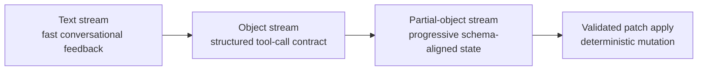
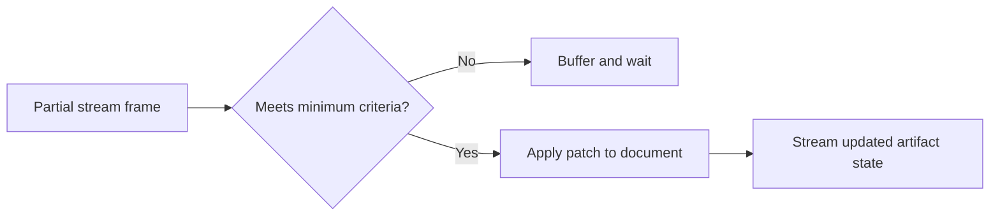

# Streaming Modes and Framework Benchmarking

This article focuses on one narrow question: how different frameworks stream structured outputs, and what that means for early document updates in production UX.

## Streaming Modes

Three modes matter in practice:

- **Text streaming:** great for conversational UX, weak for deterministic state updates.
- **Object/tool-call streaming:** stronger contracts, but often emits larger discrete chunks.
- **Partial-object streaming:** best for progressive, schema-aligned document mutation when guarded by validation.



## Framework Behaviors

Reference docs:

- [LangChain streaming](https://js.langchain.com/docs/concepts/streaming/) and [structured output](https://js.langchain.com/docs/how_to/structured_output/)
- [Mastra agent streaming patterns](https://mastra.ai/en/docs/agents/overview)
- [Vercel AI SDK streamObject + partialObjectStream](https://ai-sdk.dev/docs/reference/ai-sdk-core/stream-object)
- [BAML docs](https://docs.boundaryml.com/)

The practical difference is not just API shape, it is update granularity during generation. The charged-space playground observations showed that some frameworks emit fewer, larger partial states while others emit more frequent micro-updates.

## Benchmark Snapshot (charged-space)

The charged-space comparison recorded stronger partial-update granularity from BAML in the tested extraction flows, while AI SDK and Mastra produced fewer partial checkpoints. The exact numbers vary by schema, model, and prompt shape, but the pattern was consistent enough to drive architecture decisions.

| Framework | Streaming primitive | Observed partial update behavior | Practical implication |
|---|---|---|---|
| AI SDK | `streamObject` + `partialObjectStream` | Medium granularity | Strong default for typed partials with clean API |
| Mastra | `agent.stream()` + `objectStream` | Medium/lower granularity in tested flows | Good orchestration model, fewer early checkpoints |
| BAML | `b.stream.*` | Higher granularity in tested flows | Earlier "minimum viable" object detection |
| LangChain (pattern) | streaming + structured-output chains | Depends heavily on parser and runnable composition | Flexible but implementation-dependent |

## How Partial Streaming Actually Arrives

The stream is often incomplete at first. A patch-like object may arrive without a complete path, value, or operation list.

```json
{
  "operations": [
    { "op": "replace", "path": "/skills/2/na" }
  ]
}
```

Then later frames complete the same logical operation:

```json
{
  "operations": [
    { "op": "replace", "path": "/skills/2/name", "value": "React" }
  ]
}
```

Frameworks expose this as partial objects that match schema shape as fields fill in over time. The key is **not** applying immediately on first emission.

## Minimum Criteria Before Applying to Document

Streaming updates are released to the document only when minimum validity criteria are met:

- `op` exists and is allowed
- `path` is complete and valid JSON pointer
- `value` exists when required by the operation type
- object passes the schema guard used by the patch pipeline

Only then can incremental updates begin in the artifact view. This preserves low-latency UX without sacrificing deterministic state.

## Streaming-to-Document Flow



## Why This Matters for UX

Without this gate, users see jitter and invalid intermediate states. With it, users get immediate progress signals and stable artifact updates that are safe to render.

## Related Articles

- [Resume Chatbot Overview](/work/resume-chatbot)
- [Streaming JSON Patching Architecture](/work/resume-chatbot-streaming-architecture)
- [Deterministic Testing for AI Streaming](/work/resume-chatbot-testing-strategy)
