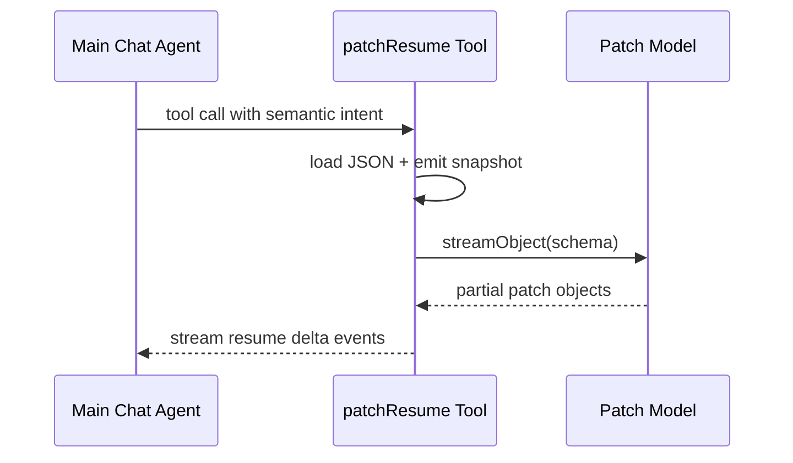
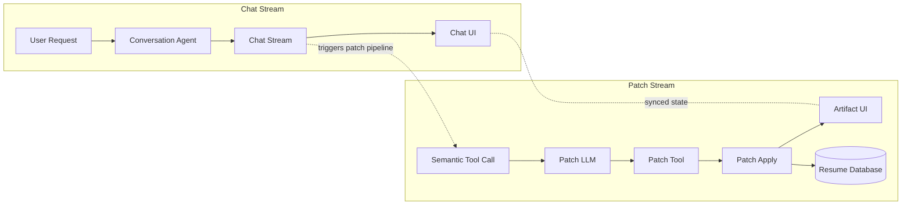

import LazyVideo from '../../components/LazyVideo.astro';
import FeatureBlock from '../../components/FeatureBlock.astro';
import ExcalidrawDiagram from '../../components/ExcalidrawDiagram.astro';
import Callout from '../../components/Callout.astro';

# AI-Powered Resume Builder with Real-Time Streaming

## <span class="h2-prefix"><span class="h2-hash" aria-hidden="true">##</span> PROBLEM:</span> <span class="h2-title">Why iterative artifact edits fail at scale</span>

**You're in a conversation with your resume.**

You type: *"Add Python to my skills and tighten up that Backend Engineer summary to highlight the API work."* You expect surgical precision - a new skill entry here, a rewritten paragraph there, everything else untouched.

But that's not how AI-driven document editing usually works.

Without structure, the same request might rewrite your entire skills section, drop half your job history, or generate a summary that sounds nothing like you. Worse, agents often read only portions of the document and make assumptions about the rest. As patches accumulate on top of incorrect assumptions, errors compound. The problem isn't the AI's intent - it's the lack of **constraints**.

**Real-time collaboration requires three things:**

<FeatureBlock
  title=""
  features={[
    {
      title: "A Schema",
      description: "Every resume field follows a predictable structure - skills, experience, projects - so the UI renders consistently no matter who edits what"
    },
    {
      title: "Live Feedback",
      description: "Changes appear as they happen. No waiting, no wondering if your edit landed, no surprises when the response finally arrives"
    },
    {
      title: "Surgical Updates",
      description: "Modifications target exactly what you specify without touching adjacent content - whether the AI makes them or you do"
    }
  ]}
/>

This is the story of building that system.

<ExcalidrawDiagram
  src="/docs/project/resume-chatbot-simple.svg"
  alt="Resume chatbot concept diagram showing user request flowing through AI processing to structured resume output"
  caption="High-level concept: Natural language requests are translated into precise, structured document mutations"
  height="600px"
/>

**Core challenges with AI-driven document edits:**

- **Partial context windows** - Edits apply to a slice and drop linked context, even when the user expects global context to be preserved
- **Ambiguous match targets** - Similar text blocks cause the wrong node to be rewritten instead of the exact entry selected by the user
- **Patch sequencing drift** - Multiple edits that should apply cleanly instead cause newline boundaries to shift and list formatting to degrade
- **Unstable insertion behavior** - Partial output causes jumps, placeholders, and visual jitter instead of smooth text appearance
- **Rich-format constraints** - Markdown-first edits break typed structures downstream, even when fields should stay validated and schema-safe

These failure modes compound when multiple users, models, or edits operate concurrently. Small unpredictabilities become merge conflicts, audit blind spots, and a poor UX that erodes trust.

<FeatureBlock
  title="Key Principles"
  features={[
    {
      title: "Collaborative Interface",
      description: "User and AI work together inside explicit structure and constraints"
    },
    {
      title: "Surgical Precision",
      description: "Targeted updates apply only where intended, without full document replacement"
    },
    {
      title: "Managed Revisions",
      description: "Clear patch history makes recovery and review straightforward"
    }
  ]}
/>

## <span class="h2-prefix"><span class="h2-hash" aria-hidden="true">##</span> STREAMING TYPES:</span> <span class="h2-title">Text vs object vs partial-object streams</span>

When building AI-powered interfaces, not all streaming is the same. Each stream type has different reliability characteristics and UX implications.

### Text Streams

Human-facing response text for conversational flow. Great for chat, but problematic for structured edits at scale. A large sequence of edits often results in accidentally overwriting information or duplicating headings - especially as the context grows for the primary agent.

Text streams also limit our ability to provide rich, custom rendering. A spreadsheet rendered as Markdown is difficult to edit precisely. An agent can't practically make small edits to a Markdown table cell without regenerating the entire table.

Yet text streaming has one clear advantage: you can follow along as the agent works. You see the edits happening in real-time, like watching a human collaborator type.

<Callout type="tip" label="Core Challenge">
  How do we combine **rich custom rendering** with **streaming edits**? We want to watch the agent work in real-time, like a human collaborator typing, but we also need structured components - tables, code blocks, resumes - that plain text can't provide.
</Callout>

### Object/Tool-Call Streams

Machine-facing structured outputs for deterministic actions. Frameworks like the Vercel AI SDK support `streamObject`, which can stream structured tool calls incrementally.

```json
{
  "tool": "addSkill",
  "arguments": { "name": "Python", "level": "intermediate" }
}
```

The challenge: tools like `addSkill` are **schema-specific**. Each field pattern needs its own tool definition, so the approach doesn't transfer to other document types. A spreadsheet editor would need entirely different tools (`addColumn`, `updateCell`), and a code editor would need yet another set. This fragments prompting strategies and prevents reuse across domains.

Even with streaming, the user still waits for each complete tool call before seeing updates - and the complexity of managing dozens of field-specific tools grows quickly.

### Partial-Object Streams

The Vercel AI SDK's `streamObject` can return objects in two modes:

**Complete objects**: Wait for the entire object to validate against your schema before emitting. The user sees nothing until the full object is ready.

**Partial objects** (what we use): Receive `DeepPartial<YourSchema>` as tokens arrive. Each emission is valid JSON but may not satisfy your schema yet. You decide when it's "complete enough" to use.

```ts
// Using partial object stream - we get updates as they arrive
const result = streamObject({ model, schema: patchSchema, prompt });

for await (const partial of result.partialObjectStream) {
  // partial is DeepPartial<PatchOperation> - valid JSON, but may not match schema yet
  // Our job: decide when it's safe to apply
  if (isCompleteEnough(partial)) {
    applyPatch(document, partial);
  }
}
```

**How it works step by step:**

The LLM emits raw text tokens. The AI SDK accumulates them and parses into valid JSON at each step:

```javascript
// LLM begins emitting: '{ "op": "repl'
// AI SDK accumulates and parses as valid JSON:
{ "op": "repl" }

// More tokens arrive: 'ace", "path": "/summary"'
// AI SDK now parses complete op + path:
{ "op": "replace", "path": "/summary" }

// Value starts streaming: ', "value": "S'
{ "op": "replace", "path": "/summary", "value": "S" }

// Continues building: 'enior bac'
{ "op": "replace", "path": "/summary", "value": "Senior bac" }

// Complete value: 'kend engineer with 8+ years'
{ "op": "replace", "path": "/summary", "value": "Senior backend engineer with 8+ years experience" }
```

**Key insight**: The AI SDK guarantees valid JSON at each step, but it doesn't guarantee the object matches your schema. That's your responsibility. In Example 1 above, we might decide that having complete `op` and `path` is "complete enough" to start showing the edit in progress, even before the full `value` arrives.

**Streaming object values** works the same way - nested properties fill in as tokens arrive:

```javascript
// Object value starts building
{ "op": "add", "path": "/skills/-", "value": { "nam": undefined } }

// Key completes, next property starts  
{ "op": "add", "path": "/skills/-", "value": { "name": "Pytho", "level": undefined } }

// Values stream in character by character
{ "op": "add", "path": "/skills/-", "value": { "name": "Python", "level": "intermedia" } }

// Complete object
{ "op": "add", "path": "/skills/-", "value": { "name": "Python", "level": "intermediate" } }
```

**Why this matters**: Without partial objects, you'd wait for the entire operation to complete before showing anything. With partial objects, you can start rendering progress immediately - but you need a stabilization layer to decide what's safe to display vs what's still incomplete.

This becomes even more important when batching multiple patches in one tool call (an array of operations). With partial object streaming, the AI SDK provides a valid array structure as objects accumulate - you can process each patch as it arrives. With whole object streaming, you'd wait even longer for ALL patches to complete before seeing any progress.
Related documentation:

- [LangChain streaming](https://js.langchain.com/docs/concepts/streaming/) and [structured output](https://js.langchain.com/docs/how_to/structured_output/)
- [Mastra agents and streaming](https://mastra.ai/en/docs/agents/overview)
- [Vercel AI SDK streamObject](https://ai-sdk.dev/docs/reference/ai-sdk-core/stream-object)
- [BAML streaming and partial parsing](https://docs.boundaryml.com/)

## <span class="h2-prefix"><span class="h2-hash" aria-hidden="true">##</span> TOOLING OPTIONS:</span> <span class="h2-title">Approaches to structured document edits</span>

Given the problem and the streaming options available, we evaluated three approaches for implementing AI-driven document edits.

### Option A: Schema-Specific Tool Surface

Create many discrete tools like `addWorkItem`, `replaceSummary`, `updateSkill`, each with custom inputs tailored to the resume schema.

**Pros:**

- Easy to reason about for one narrow schema
- Type-safe by design

**Cons:**

- Tool count grows with every new field pattern
- Streaming contracts fragment across tools
- Cross-document reuse collapses - each new document type needs its own complete tool suite

### Option B: Full-Object Structured Generation

Stream or generate one complete typed object and replace the entire document state after validation.

**Pros:**

- Clean contract for final state
- Strong schema guardrails

**Cons:**

- Poor incremental UX for large artifacts
- Small edits (like adding one skill) wait for the entire object to generate and validate
  - [AI SDK generateObject](https://ai-sdk.dev/docs/reference/ai-sdk-core/generate-object)
  - [Mastra structured output](https://mastra.ai/docs/agents/structured-output)
  - [LangChain structured output](https://js.langchain.com/docs/how_to/structured_output/)

### Option C: Streaming JSON Patch (Chosen)

Emit [RFC 6902](https://datatracker.ietf.org/doc/html/rfc6902) operations (`add`, `replace`, `remove`, `move`, `copy`, `test`) against stable JSON pointers. Treat the resume as typed JSON, not a text blob. Every mutation is one explicit operation against one explicit path.

**Pros:**

- Low-latency, path-scoped updates with deterministic apply semantics
- One mutation model works across nested objects, arrays, and other structured documents
- Enables true incremental rendering - users see changes as they arrive

**Core principles:**

- **Immutable structure:** the document schema stays stable while values change.
- **Atomic operations:** apply `add`, `replace`, `remove`, `move`, `copy`, and `test` from RFC 6902.
- **Deterministic result:** no broad regeneration, no accidental section rewrites.

```json
{
  "op": "replace",
  "path": "/skills/2/name",
  "value": "React"
}
```

## <span class="h2-prefix"><span class="h2-hash" aria-hidden="true">##</span> OUR SOLUTION:</span> <span class="h2-title">Streaming JSON Patch with partial-object stabilization</span>

We chose Option C--streaming JSON Patch with partial-object streams--because it uniquely combines the responsiveness of streaming with the precision of structured operations.

### The Data Model: JSON Resume as Stable Surface

We chose [JSON Resume](https://jsonresume.org/) as our data format - an open-source standard for representing resume data as structured JSON. This format provides a simple yet extensible schema that covers all essential resume sections: basics, work experience, education, skills, projects, and more.

**Why JSON Resume:**

- **Established standard** - Widely adopted schema with clear documentation and community support
- **Built-in validation** - JSON Schema definition enables automated validation of resume structure and data types
- **Existing tooling** - Ecosystem includes renderers for HTML export and PDF generation
- **Extensible design** - Custom properties can be added for domain-specific needs while maintaining compatibility
- **Portable format** - Plain JSON enables easy data migration and interoperability

In practice, we use the JSON Resume schema for data storage and validation (via Zod), but built a custom renderer to match our application's visual style rather than using off-the-shelf HTML themes. This gives us complete control over the presentation while benefiting from the standard's structured data model.

```json
{
  "basics": {
    "name": "Nick Roth",
    "label": "Full-Stack Developer",
    "email": "nick@example.com",
    "summary": "Backend engineer with 8+ years experience",
    "location": { "city": "San Francisco", "countryCode": "US" }
  },
  "work": [
    {
      "company": "Acme Corp",
      "position": "Senior Engineer",
      "startDate": "2022-01",
      "highlights": ["Led API redesign", "Reduced latency by 40%"]
    }
  ],
  "education": [
    {
      "institution": "University of Washington",
      "studyType": "Computer Science",
      "startDate": "2014-09"
    }
  ],
  "skills": [
    { "name": "TypeScript", "level": "advanced" },
    { "name": "Python", "level": "intermediate" }
  ],
  "projects": [
    {
      "name": "Resume Chatbot",
      "description": "AI-powered resume editor with streaming JSON patches"
    }
  ]
}
```

Structured paths are unambiguous: a pointer like `/skills/0/name` refers to the first skill's name. Contrastingly, asking "find JavaScript in the text" can hit many places, match partial phrases, or pick the wrong list. With JSON Pointers and RFC 6902 patches we target exact keys and array indices.

Finally, we validate mutations with a schema layer (Zod in our stack). Zod catches missing required fields, wrong types, and invalid shapes before a patch is applied, so the editor never writes malformed resume state.

### The Tool Layer: Nested Streaming Architecture

The chat agent handles intent and explanation. The patch tool handles state mutation. Inside that tool, a nested model streams patch objects.



```ts
const result = streamObject({ model, schema: patchSchema, prompt })
for await (const partial of result.partialObjectStream) {
  const stabilized = stabilize(partial)
  if (!stabilized) continue
  applyPatch(document, [stabilized])
  emitDelta(document)
}
```

### Schema Architecture: Tool vs Patch Object

The streaming tool layer uses two distinct schemas working in coordination: the outer **tool schema** defines how the resume data is patched, while the inner **patch object schema** defines the structure of each individual patch operation.

#### Tool Schema (Outer Layer)

The `patchResume` tool schema defines the tool's interface - the input it expects from the main chat agent:

```typescript
// Schema for the tool call itself
const patchResumeToolSchema = z.object({
  explanation: z.string().describe('Reason for the change'),
  patch: z.object({
    operations: z.array(patchOperationSchema)
      .describe('JSON Patch operations to apply')
  })
});
```

This outer schema stays relatively simple. It wraps the patch operations and provides metadata (explanation) for the UI to display.

#### Patch Object Schema (Inner Layer)

Inside the tool, each individual patch operation follows a stricter, nested schema that the AI SDK streams incrementally:

```typescript
// Schema for each individual patch operation
const patchOperationSchema = z.object({
  op: z.enum(['add', 'replace', 'remove']),
  path: z.string().describe('JSON Pointer path (RFC 6902)'),
  value: z.union([
    z.string(),
    z.number(),
    z.boolean(),
    z.array(z.string()),
    z.object({}).passthrough(), // Nested objects for complex values
    z.null()
  ]).optional()
});
```

The key difference: the **tool schema** defines what the tool *receives* (structured data), while the **patch schema** defines what gets *streamed* (partial objects that stabilize into valid operations). The streaming layer doesn't see the tool schema - it sees the patch operations being built token by token until they form complete, valid JSON Patch operations.

<Callout type="tip" label="Optimization Note">
  The `z.union` for `value` could be refined per-operation. For `remove` operations, `value` is unused. For `add`/`replace`, the value type depends on the target path. We could use discriminated unions keyed on `op`, but that increases schema complexity. Balance simplicity against precision based on your validation needs.
</Callout>

### Patch Operations: RFC 6902 Verbs

Small, explicit verbs keep state transitions inspectable and testable.

#### Add for Insertions

```json
{ "op": "add", "path": "/skills/-", "value": "Python" }
```

#### Replace for Corrections

```json
{ "op": "replace", "path": "/summary", "value": "Experienced backend engineer..." }
```

#### Remove for Deletions

```json
{ "op": "remove", "path": "/work/2" }
```

Reference: [RFC 6902 JSON Patch](https://datatracker.ietf.org/doc/html/rfc6902)

### Partial Stabilization: Safety Before Apply

Patch values can be any valid JSON payload, not only strings. In practice, we stabilize structure first (`op` + `path`), then stream value content as it arrives.

```json
{
  "operations": [
    { "op": "replace", "path": "/skills/2/name", "value": "React" },
    { "op": "replace", "path": "/basics/location", "value": { "city": "Seattle", "countryCode": "US" } },
    { "op": "add", "path": "/work/1/highlights", "value": ["Reduced test runtime by 68%.", "Stabilized flaky CI checks."] }
  ]
}
```

If each update arrived as a full-object tool call, each object would pop in only when that object was fully emitted and validated. The patch stream starts earlier.

```json
{
  "operations": [{ "op": "replace", "path": "/skills/2/na" }]
}
```

At this point, apply is blocked: the pointer is incomplete and value is absent.

```json
{
  "operations": [{ "op": "replace", "path": "/skills/2/name", "value": "React" }]
}
```

At this point, apply can begin. The minimum gate is: complete `op`, complete `path`, and required `value` started/available.

```ts
for await (const partial of partialObjectStream) {
  const next = stabilize(partial)
  if (!next.op || !isCompletePointer(next.path)) continue
  if (requiresValue(next.op) && !hasValue(next)) continue
  applyPatch(document, [next])
}
```

### Safety and Validation: Stabilization Layer

The UI should never render broken partial frames. The stabilizer blocks invalid fragments until they meet minimum criteria.

- Complete pointer syntax
- Zod schema validity
- Allowed mutable path

```ts
function canApply(op: PatchOp) {
  return isCompletePointer(op.path)
    && patchSchema.safeParse(op).success
    && allowlist.has(op.path)
}
```

### Concurrency: Path-Isolated Operations

Independent paths can update in parallel without collisions.

```json
[
  { "op": "replace", "path": "/summary", "value": "..." },
  { "op": "add", "path": "/skills/-", "value": "Python" }
]
```

This gives effectively O(1)-style conflict checks for unrelated paths, while history remains append-only through versioned document snapshots.

## <span class="h2-prefix"><span class="h2-hash" aria-hidden="true">##</span> ARCHITECTURE:</span> <span class="h2-title">System design and implementation</span>

<ExcalidrawDiagram
  src="/docs/project/resume-chatbot-architecture.svg"
  alt="System architecture diagram showing end-to-end data flow from user request through chat agent, patch tool, and database"
  caption="High-level system architecture: User request flows through the Chat Stream for immediate feedback while the Patch Stream handles document mutations via streaming JSON patches."
  height="600px"
/>

### Split Planning from Patch Translation

Separating intent from mutation reduces surprising edits, makes changes auditable, and keeps the mutation path deterministic.

#### Planner Model

- Understands natural language, extracts user intent and entities (intent: "add skill", entity: "Python").
- Produces a semantic change description, not concrete ops, including target pointer hints and validation cues.
- Handles ambiguity: asks clarifying questions or emits confidence/meta fields when unsure.

#### Translator Model

- Consumes semantic intent and resolves concrete RFC 6902 operations, array indices, and JSON Pointer paths.
- Validates paths against schema and emits guarded operations (includes "test" ops when needed).
- Ensures idempotence and produces a compact, auditable patch sequence.

Example handshake (planner tool-call payload):

```json
{ "intent": "add_skill", "summary": "Add Python to skills", "value": { "name": "Python", "level": "intermediate" }, "target": "/skills", "confidence": 0.92 }
```

Translator output (RFC 6902):

```json
[ { "op": "add", "path": "/skills/2", "value": { "name": "Python", "level": "intermediate" } } ]
```

Benefits: clearer responsibilities, flexible NLU, deterministic mutation, and a complete audit trail for reviewers.

### Hybrid Interface: Editor Plus Chat Confirmation

The document pane renders structured state; the chat pane explains intent and confirms patch outcomes. This keeps UX conversational while preserving precise state transitions.

- Selection context scopes the patch target.
- Patch-apply confirmations provide immediate trust signals.
- The same operation stream powers both visual diff and persisted history.

### System Architecture: Three Synchronized Channels



This architecture separates concerns: the Chat Stream keeps the UI responsive while the Patch Stream performs guarded, auditable mutations.

1. User sends a message to the Conversation Agent, which produces the Chat Stream for UI feedback (Chat Stream, Chat UI).
2. The Chat Stream emits text while the planner evaluates intent in parallel (Chat Stream -> triggers patch pipeline).
3. When intent requires a document change, the planner emits a Semantic Tool Call that starts the Patch Stream (Semantic Tool Call).
4. The Patch Tool immediately loads the document and streams a snapshot to the Artifact UI so users see the current state (Patch Tool -> Artifact UI).
5. A nested Patch LLM generates RFC 6902 patch ops incrementally, sending Partial-Object updates (Patch LLM -> Patch Tool).
6. Once patches stabilize (complete op, path, and value), the Patch Apply step commits them to the Resume Database and the apply operation is recorded (Patch Apply -> Resume Database).
7. The updated artifact state streams back to the Artifact UI and synchronizes with the Chat UI so conversation and edits stay aligned (Artifact UI and Chat UI stay in sync).

**Why this architecture wins:**

- Keeps conversational latency low by streaming chat separately from mutation work.
- Makes edits auditable and reversible by emitting small, path-scoped RFC 6902 operations.
- Enables safe incremental updates: the UI sees progress early while the translator and validator enforce correctness.

## <span class="h2-prefix"><span class="h2-hash" aria-hidden="true">##</span> DEMO:</span> <span class="h2-title">Progressive patches in action</span>

The demo shows progressive RFC 6902 patches being applied without full-document replacement. The user sees conversational feedback and artifact updates in parallel.

<LazyVideo
  videoUrl="https://drive.google.com/file/d/1Hb6bH99F8uEqPU7BhpI4fS0UTeuEhrhC/preview"
  thumbnailSrc="/assets/images/projects/resume-chatbot-demo-frame.webp"
  thumbnailAlt="Resume chatbot demo showing real-time streaming edits"
  caption="The resume chatbot applying surgical JSON patches in real-time"
/>

## <span class="h2-prefix"><span class="h2-hash" aria-hidden="true">##</span> TESTING:</span> <span class="h2-title">Strategy and results</span>

Testing is split into deterministic model mocks and schema assertions.

- **Deterministic mocks:** remove network/model variability from core checks.
- **Schema assertions:** verify final JSON correctness without timing fragility.

Results:

<ul class="comparable-list">
  <li><span class="metric-label metric-before">Before</span> <span class="metric-value metric-before">~50%</span> stability, <span class="stat-callout stat-negative">28.8s</span> avg per test</li>
  <li><span class="metric-label metric-after">After</span> <span class="metric-value metric-after">100%</span> stability, <span class="stat-callout stat-positive">9.2s</span> avg per test</li>
</ul>

For full harness details, see [Deterministic Testing for AI Streaming](/work/resume-chatbot-testing-strategy).

## <span class="h2-prefix"><span class="h2-hash" aria-hidden="true">##</span> HANDOFF:</span> <span class="h2-title">Deep dives and next reading</span>

- [Streaming JSON Patching Architecture](/work/resume-chatbot-streaming-architecture) - Detailed pipeline internals, lifecycle of patch operations, and failure handling patterns.
- [Deterministic Testing for AI Streaming](/work/resume-chatbot-testing-strategy) - Mock-provider approach for repeatable streaming tests and measurable reliability results.
- [Streaming Modes and Framework Benchmarking](/work/resume-chatbot-streaming-modes-benchmarking) - Comparative analysis of streaming modes across frameworks with performance tradeoffs.
