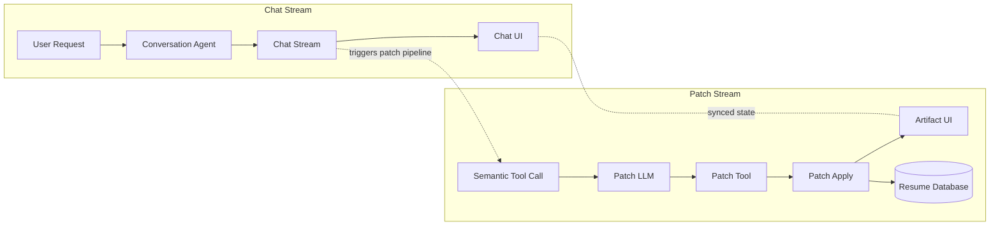

import LazyVideo from '../../components/LazyVideo.astro';
import FeatureBlock from '../../components/FeatureBlock.astro';

# AI-Powered Resume Builder with Real-Time Streaming

## <span class="h2-prefix"><span class="h2-hash">##</span> PROBLEM:</span> <span class="h2-title">Why iterative artifact edits fail at scale</span>

- **Partial context windows:** large documents are read in slices, so local edits miss global structure.
- **Ambiguous match targets:** similar blocks can satisfy the same patch selector and update the wrong area.
- **Patch sequencing drift:** chained edits break formatting when newline boundaries are emitted incorrectly.
- **Unstable insertion behavior:** content appears to jump while streamed text is still incomplete.
- **Rich-format constraints:** markdown-first editing breaks down when output demands richer structure.

The core issue is predictability at scale. Collaborative editing needs concise, deterministic mutations instead of broad regeneration.

<FeatureBlock
  title="Key Principles"
  features={[
    {
      title: "Collaborative Interface",
      description: "User and AI work together inside explicit structure and constraints"
    },
    {
      title: "Surgical Precision",
      description: "Targeted updates apply only where intended, without full document replacement"
    },
    {
      title: "Managed Revisions",
      description: "Clear patch history makes recovery and review straightforward"
    }
  ]}
/>

## <span class="h2-prefix"><span class="h2-hash">##</span> STREAM MODEL:</span> <span class="h2-title">Text vs object vs partial-object streams</span>

Streaming is not one contract.

- **Text stream:** human-facing response text for conversational flow.
- **Object/tool-call stream:** machine-facing structured outputs for deterministic actions.
- **Partial-object stream:** incremental structured payloads that become valid after stabilization.

This separation lets chat stay responsive while document mutation remains safe.

## <span class="h2-prefix"><span class="h2-hash">##</span> DATA MODEL:</span> <span class="h2-title">JSON Resume as a stable mutation surface</span>

Resume data is stored as structured JSON (basics, work, education, skills, projects). That provides stable paths and type boundaries, so updates can be validated before apply.

## <span class="h2-prefix"><span class="h2-hash">##</span> TOOLING TRADEOFF:</span> <span class="h2-title">Custom schema tools vs JSON Patch</span>

Other approaches considered included a large schema-specific tool surface (`addWorkItem`, `updateSkill`, `replaceSummary`, and many more field-level variants).

That approach was decided against because each new edit shape requires a new tool-call contract, plus custom streaming behavior for partial payloads. Tool design becomes brittle as document complexity grows, and maintenance cost compounds quickly. It also does not transfer well to other structured document formats, since most tools are schema-specific by construction.

JSON Patch (RFC 6902) provides a single operation model (`add`, `replace`, `remove`, `move`, `copy`, `test`) at any depth. The same patch contract works across nested objects and arrays, and the same streaming/application logic can be reused for any structured document type.

## <span class="h2-prefix"><span class="h2-hash">##</span> PATCH MODEL:</span> <span class="h2-title">Operation shape and partial stabilization</span>

```json
{
  "operations": [
    { "op": "replace", "path": "/skills/2/name", "value": "React" },
    { "op": "add", "path": "/work/1/highlights/-", "value": "Reduced test runtime by 68%." }
  ]
}
```

Streamed partials are buffered until path and value are structurally stable, then applied in order.

## <span class="h2-prefix"><span class="h2-hash">##</span> INTEGRATION:</span> <span class="h2-title">Split planning from patch translation</span>

Responsibilities are split for reliability:

- **Planner model:** maps natural language to semantic change intent.
- **Patch translator model:** maps semantic intent to RFC 6902 tool-call payloads.

This keeps intent reasoning flexible while mutation stays deterministic and auditable.

## <span class="h2-prefix"><span class="h2-hash">##</span> ARCHITECTURE:</span> <span class="h2-title">Three synchronized channels with one clear fork</span>



## <span class="h2-prefix"><span class="h2-hash">##</span> DEMO:</span> <span class="h2-title">What it shows</span>

The demo shows progressive RFC 6902 patches being applied without full-document replacement. The user sees conversational feedback and artifact updates in parallel.

<LazyVideo
  videoUrl="https://drive.google.com/file/d/1Hb6bH99F8uEqPU7BhpI4fS0UTeuEhrhC/preview"
  thumbnailSrc="/assets/images/projects/resume-chatbot-demo-frame.webp"
  thumbnailAlt="Resume chatbot demo showing real-time streaming edits"
  caption="The resume chatbot applying surgical JSON patches in real-time"
/>

## <span class="h2-prefix"><span class="h2-hash">##</span> TESTING:</span> <span class="h2-title">Strategy and results</span>

Testing is split into deterministic model mocks and schema assertions.

- **Deterministic mocks:** remove network/model variability from core checks.
- **Schema assertions:** verify final JSON correctness without timing fragility.

Results:

<ul class="comparable-list">
  <li><span class="metric-label metric-before">Before</span> <span class="metric-value metric-before">~50%</span> stability, <span class="stat-callout stat-negative">28.8s</span> avg per test</li>
  <li><span class="metric-label metric-after">After</span> <span class="metric-value metric-after">100%</span> stability, <span class="stat-callout stat-positive">9.2s</span> avg per test</li>
</ul>

For full harness details, see [Deterministic Testing for AI Streaming](/work/resume-chatbot-testing-strategy).

## <span class="h2-prefix"><span class="h2-hash">##</span> HANDOFF:</span> <span class="h2-title">Deep dives and next reading</span>

- [Streaming JSON Patching Architecture](/work/resume-chatbot-streaming-architecture): pipeline internals and operation lifecycle.
- [Deterministic Testing for AI Streaming](/work/resume-chatbot-testing-strategy): mock-provider strategy and reliability benchmarks.
