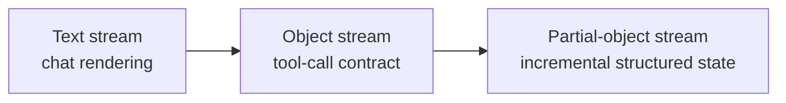
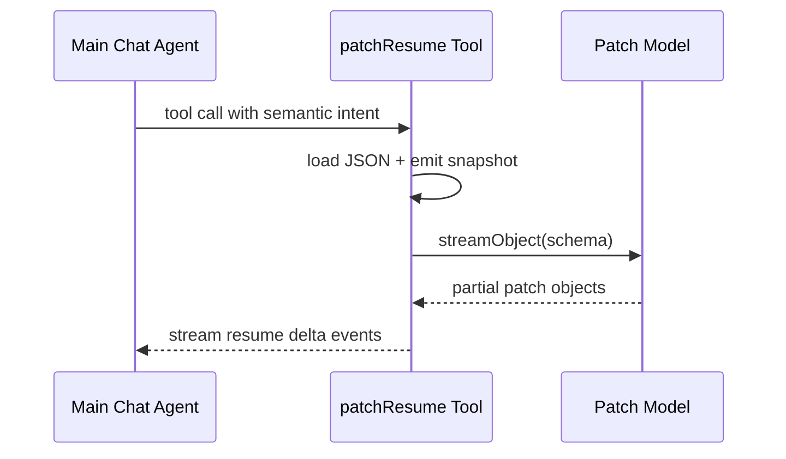
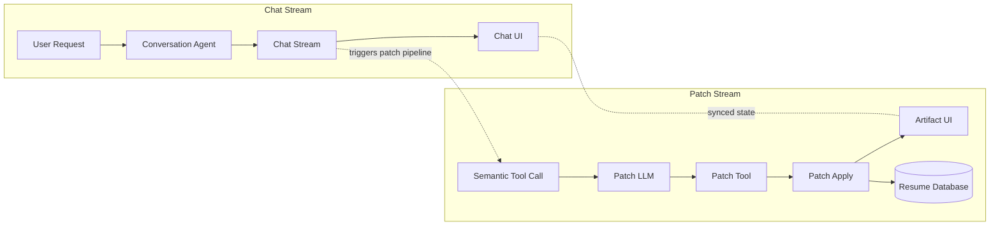

import LazyVideo from '../../components/LazyVideo.astro';
import FeatureBlock from '../../components/FeatureBlock.astro';

# AI-Powered Resume Builder with Real-Time Streaming

## <span class="h2-prefix"><span class="h2-hash">##</span> PROBLEM:</span> <span class="h2-title">Why iterative artifact edits fail at scale</span>

Imagine a user saying, "Please add Python to my skills and tighten the Senior Backend Engineer job summary to mention API design." The user expects the editor to add a single skill entry and rewrite one paragraph, leaving the rest of the resume untouched. In practice, AI-driven edits to large artifacts rarely behave that cleanly.

<div class="drift-compare" role="list" aria-label="Document drift failure modes">
  <article class="drift-item" role="listitem">
    <p class="drift-label">Partial context windows</p>
    <p><strong>Expected:</strong> Small localized change with global context preserved.</p>
    <p><strong>Observed:</strong> Edit applies to a slice and drops linked context.</p>
  </article>
  <article class="drift-item" role="listitem">
    <p class="drift-label">Ambiguous match targets</p>
    <p><strong>Expected:</strong> Update the exact skills entry selected by the user.</p>
    <p><strong>Observed:</strong> Similar text blocks match and the wrong node is rewritten.</p>
  </article>
  <article class="drift-item" role="listitem">
    <p class="drift-label">Patch sequencing drift</p>
    <p><strong>Expected:</strong> Multiple edits apply cleanly, preserving structure and spacing.</p>
    <p><strong>Observed:</strong> Newline boundaries shift and list formatting degrades.</p>
  </article>
  <article class="drift-item" role="listitem">
    <p class="drift-label">Unstable insertion behavior</p>
    <p><strong>Expected:</strong> New text appears smoothly where it belongs.</p>
    <p><strong>Observed:</strong> Partial output causes jumps, placeholders, and visual jitter.</p>
  </article>
  <article class="drift-item" role="listitem">
    <p class="drift-label">Rich-format constraints</p>
    <p><strong>Expected:</strong> Typed fields stay validated and schema-safe.</p>
    <p><strong>Observed:</strong> Markdown-first edits break typed structures downstream.</p>
  </article>
</div>

This pattern matters because each failure mode compounds when multiple users, models, or edits operate concurrently. Small unpredictabilities become merge conflicts, audit blind spots, and a poor UX that erodes trust.

<FeatureBlock
  title="Key Principles"
  features={[
    {
      title: "Collaborative Interface",
      description: "User and AI work together inside explicit structure and constraints"
    },
    {
      title: "Surgical Precision",
      description: "Targeted updates apply only where intended, without full document replacement"
    },
    {
      title: "Managed Revisions",
      description: "Clear patch history makes recovery and review straightforward"
    }
  ]}
/>

## <span class="h2-prefix"><span class="h2-hash">##</span> SOLUTION:</span> <span class="h2-title">Surgical JSON patching instead of full regeneration</span>

Treat the resume as typed JSON, not a text blob. Every mutation is one explicit operation against one explicit path.

- **Immutable structure:** the document schema stays stable while values change.
- **Atomic operations:** apply `add`, `replace`, `remove`, `move`, `copy`, and `test` from RFC 6902.
- **Deterministic result:** no broad regeneration, no accidental section rewrites.

```json
{
  "op": "replace",
  "path": "/skills/2/name",
  "value": "React"
}
```

## <span class="h2-prefix"><span class="h2-hash">##</span> STREAM MODEL:</span> <span class="h2-title">Text vs object vs partial-object streams</span>

Streaming is not one contract. Each stream type has a different reliability profile and different UX implications.

- **Text stream:** human-facing response text for conversational flow.
- **Object/tool-call stream:** machine-facing structured outputs for deterministic actions.
- **Partial-object stream:** incremental structured payloads that become valid after stabilization.

This separation lets chat stay responsive while document mutation remains safe.



Related docs for each framework:

- [LangChain streaming](https://js.langchain.com/docs/concepts/streaming/) and [structured output](https://js.langchain.com/docs/how_to/structured_output/)
- [Mastra agents and streaming](https://mastra.ai/en/docs/agents/overview)
- [Vercel AI SDK streamObject](https://ai-sdk.dev/docs/reference/ai-sdk-core/stream-object)
- [BAML streaming and partial parsing](https://docs.boundaryml.com/)

For the full framework comparison, partial-object behavior details, and benchmark results collected in charged-space, see [Streaming Modes and Framework Benchmarking](/work/resume-chatbot-streaming-modes-benchmarking).

## <span class="h2-prefix"><span class="h2-hash">##</span> DATA MODEL:</span> <span class="h2-title">JSON Resume as a stable mutation surface</span>
 
Resume data is stored as structured JSON (basics, work, education, skills, projects). Using the JSON Resume schema gives us a stable, well-known surface to target edits, reuse existing toolchains, and keep type boundaries explicit for validation.

```json
{
  "basics": { "name": "Nick Roth", "label": "Full-Stack Developer" },
  "work": [{ "company": "Acme", "position": "Engineer", "highlights": ["API design"] }],
  "skills": [{ "name": "JavaScript", "level": "advanced" }]
}
```

Structured paths are unambiguous: a pointer like `/skills/0/name` refers to the first skill's name. Contrastingly, asking "find JavaScript in the text" can hit many places, match partial phrases, or pick the wrong list. With JSON Pointers and RFC 6902 patches we target exact keys and array indices.

Finally, we validate mutations with a schema layer (Zod in our stack). Zod catches missing required fields, wrong types, and invalid shapes before a patch is applied, so the editor never writes malformed resume state.

## <span class="h2-prefix"><span class="h2-hash">##</span> TOOL LAYER:</span> <span class="h2-title">Nested streaming for low-latency structured edits</span>

The chat agent handles intent and explanation. The patch tool handles state mutation. Inside that tool, a nested model streams patch objects.



```ts
const result = streamObject({ model, schema: patchSchema, prompt })
for await (const partial of result.partialObjectStream) {
  const stabilized = stabilize(partial)
  if (!stabilized) continue
  applyPatch(document, [stabilized])
  emitDelta(document)
}
```

## <span class="h2-prefix"><span class="h2-hash">##</span> TOOLING TRADEOFF:</span> <span class="h2-title">Custom schema tools vs JSON Patch</span>

### Option A - schema-specific tool surface

- **Shape:** many tools like `addWorkItem`, `replaceSummary`, `updateSkill`, each with custom inputs.
- **Strength:** easy to reason about for one narrow schema.
- **Failure mode:** tool count grows with every new field pattern, streaming contracts fragment, and cross-document reuse collapses.

### Option B - full-object structured generation

- **Shape:** stream or generate one full typed object and replace state after validation.
- **Strength:** clean contract for final state and strong schema guardrails.
- **Failure mode:** poor incremental UX for large artifacts, because small edits still wait on larger object completion.
- **References:** [AI SDK generateObject](https://ai-sdk.dev/docs/reference/ai-sdk-core/generate-object), [Mastra structured output](https://mastra.ai/docs/agents/structured-output), [LangChain structured output](https://js.langchain.com/docs/how_to/structured_output/)

### Option C (chosen) - streaming JSON Patch

- **Shape:** emit RFC 6902 operations (`add`, `replace`, `remove`, `move`, `copy`, `test`) against stable pointers.
- **Strength:** low-latency, path-scoped updates with deterministic apply semantics.
- **Scales better:** one mutation model works across nested objects, arrays, and other structured documents.

## <span class="h2-prefix"><span class="h2-hash">##</span> PATCH MODEL:</span> <span class="h2-title">Operation shape and partial stabilization</span>

Patch values can be any valid JSON payload, not only strings. In practice, we stabilize structure first (`op` + `path`), then stream value content as it arrives.

```json
{
  "operations": [
    { "op": "replace", "path": "/skills/2/name", "value": "React" },
    { "op": "replace", "path": "/basics/location", "value": { "city": "Seattle", "countryCode": "US" } },
    { "op": "add", "path": "/work/1/highlights", "value": ["Reduced test runtime by 68%.", "Stabilized flaky CI checks."] }
  ]
}
```

If each update arrived as a full-object tool call, each object would pop in only when that object was fully emitted and validated. The patch stream starts earlier.

```json
{
  "operations": [{ "op": "replace", "path": "/skills/2/na" }]
}
```

At this point, apply is blocked: the pointer is incomplete and value is absent.

```json
{
  "operations": [{ "op": "replace", "path": "/skills/2/name", "value": "React" }]
}
```

At this point, apply can begin. The minimum gate is: complete `op`, complete `path`, and required `value` started/available.

```ts
for await (const partial of partialObjectStream) {
  const next = stabilize(partial)
  if (!next.op || !isCompletePointer(next.path)) continue
  if (requiresValue(next.op) && !hasValue(next)) continue
  applyPatch(document, [next])
}
```

## <span class="h2-prefix"><span class="h2-hash">##</span> PROTOCOL:</span> <span class="h2-title">Map natural-language intent to RFC 6902 verbs</span>

Small, explicit verbs keep state transitions inspectable and testable.

### `add` for insertions
```json
{ "op": "add", "path": "/skills/-", "value": "Python" }
```

### `replace` for corrections
```json
{ "op": "replace", "path": "/summary", "value": "Experienced backend engineer..." }
```

### `remove` for deletions
```json
{ "op": "remove", "path": "/work/2" }
```

Reference: [RFC 6902 JSON Patch](https://datatracker.ietf.org/doc/html/rfc6902)

## <span class="h2-prefix"><span class="h2-hash">##</span> STABILIZATION:</span> <span class="h2-title">Safety valve before UI apply</span>

The UI should never render broken partial frames. The stabilizer blocks invalid fragments until they meet minimum criteria.

- Complete pointer syntax
- Zod schema validity
- Allowed mutable path

```ts
function canApply(op: PatchOp) {
  return isCompletePointer(op.path)
    && patchSchema.safeParse(op).success
    && allowlist.has(op.path)
}
```

## <span class="h2-prefix"><span class="h2-hash">##</span> CONCURRENCY:</span> <span class="h2-title">Path-isolated operations enable parallelism</span>

Independent paths can update in parallel without collisions.

```json
[
  { "op": "replace", "path": "/summary", "value": "..." },
  { "op": "add", "path": "/skills/-", "value": "Python" }
]
```

This gives effectively O(1)-style conflict checks for unrelated paths, while history remains append-only through versioned document snapshots.

## <span class="h2-prefix"><span class="h2-hash">##</span> INTEGRATION:</span> <span class="h2-title">Split planning from patch translation</span>

Separating intent from mutation reduces surprising edits, makes changes auditable, and keeps the mutation path deterministic.

### Planner Model

- Understands natural language, extracts user intent and entities (intent: "add skill", entity: "Python").
- Produces a semantic change description, not concrete ops, including target pointer hints and validation cues.
- Handles ambiguity: asks clarifying questions or emits confidence/meta fields when unsure.

### Translator Model

- Consumes semantic intent and resolves concrete RFC 6902 operations, array indices, and JSON Pointer paths.
- Validates paths against schema and emits guarded operations (includes "test" ops when needed).
- Ensures idempotence and produces a compact, auditable patch sequence.

Example handshake (planner tool-call payload):

```json
{ "intent": "add_skill", "summary": "Add Python to skills", "value": { "name": "Python", "level": "intermediate" }, "target": "/skills", "confidence": 0.92 }
```

Translator output (RFC 6902):

```json
[ { "op": "add", "path": "/skills/2", "value": { "name": "Python", "level": "intermediate" } } ]
```

Benefits: clearer responsibilities, flexible NLU, deterministic mutation, and a complete audit trail for reviewers.

## <span class="h2-prefix"><span class="h2-hash">##</span> HYBRID INTERFACE:</span> <span class="h2-title">Document editor plus chat confirmation loop</span>

The document pane renders structured state; the chat pane explains intent and confirms patch outcomes. This keeps UX conversational while preserving precise state transitions.

- Selection context scopes the patch target.
- Patch-apply confirmations provide immediate trust signals.
- The same operation stream powers both visual diff and persisted history.

## <span class="h2-prefix"><span class="h2-hash">##</span> ARCHITECTURE:</span> <span class="h2-title">Three synchronized channels with one clear fork</span>



A short, concrete explanation of the diagram and how the channels cooperate. This architecture separates concerns: the Chat Stream keeps the UI responsive while the Patch Stream performs guarded, auditable mutations.

1. User sends a message to the Conversation Agent, which produces the Chat Stream for UI feedback (Chat Stream, Chat UI).
2. The Chat Stream emits text while the planner evaluates intent in parallel (Chat Stream -> triggers patch pipeline).
3. When intent requires a document change, the planner emits a Semantic Tool Call that starts the Patch Stream (Semantic Tool Call).
4. The Patch Tool immediately loads the document and streams a snapshot to the Artifact UI so users see the current state (Patch Tool -> Artifact UI).
5. A nested Patch LLM generates RFC 6902 patch ops incrementally, sending Partial-Object updates (Patch LLM -> Patch Tool).
6. Once patches stabilize (complete op, path, and value), the Patch Apply step commits them to the Resume Database and the apply operation is recorded (Patch Apply -> Resume Database).
7. The updated artifact state streams back to the Artifact UI and synchronizes with the Chat UI so conversation and edits stay aligned (Artifact UI and Chat UI stay in sync).

### Why this architecture wins

- Keeps conversational latency low by streaming chat separately from mutation work.
- Makes edits auditable and reversible by emitting small, path-scoped RFC 6902 operations.
- Enables safe incremental updates: the UI sees progress early while the translator and validator enforce correctness.

## <span class="h2-prefix"><span class="h2-hash">##</span> DEMO:</span> <span class="h2-title">What it shows</span>

The demo shows progressive RFC 6902 patches being applied without full-document replacement. The user sees conversational feedback and artifact updates in parallel.

<LazyVideo
  videoUrl="https://drive.google.com/file/d/1Hb6bH99F8uEqPU7BhpI4fS0UTeuEhrhC/preview"
  thumbnailSrc="/assets/images/projects/resume-chatbot-demo-frame.webp"
  thumbnailAlt="Resume chatbot demo showing real-time streaming edits"
  caption="The resume chatbot applying surgical JSON patches in real-time"
/>

## <span class="h2-prefix"><span class="h2-hash">##</span> TESTING:</span> <span class="h2-title">Strategy and results</span>

Testing is split into deterministic model mocks and schema assertions.

- **Deterministic mocks:** remove network/model variability from core checks.
- **Schema assertions:** verify final JSON correctness without timing fragility.

Results:

<ul class="comparable-list">
  <li><span class="metric-label metric-before">Before</span> <span class="metric-value metric-before">~50%</span> stability, <span class="stat-callout stat-negative">28.8s</span> avg per test</li>
  <li><span class="metric-label metric-after">After</span> <span class="metric-value metric-after">100%</span> stability, <span class="stat-callout stat-positive">9.2s</span> avg per test</li>
</ul>

For full harness details, see [Deterministic Testing for AI Streaming](/work/resume-chatbot-testing-strategy).

## <span class="h2-prefix"><span class="h2-hash">##</span> HANDOFF:</span> <span class="h2-title">Deep dives and next reading</span>

- [Streaming JSON Patching Architecture](/work/resume-chatbot-streaming-architecture) - Detailed pipeline internals, lifecycle of patch operations, and failure handling patterns.
- [Deterministic Testing for AI Streaming](/work/resume-chatbot-testing-strategy) - Mock-provider approach for repeatable streaming tests and measurable reliability results.
- [Streaming Modes and Framework Benchmarking](/work/resume-chatbot-streaming-modes-benchmarking) - Comparative analysis of streaming modes across frameworks with performance tradeoffs.
